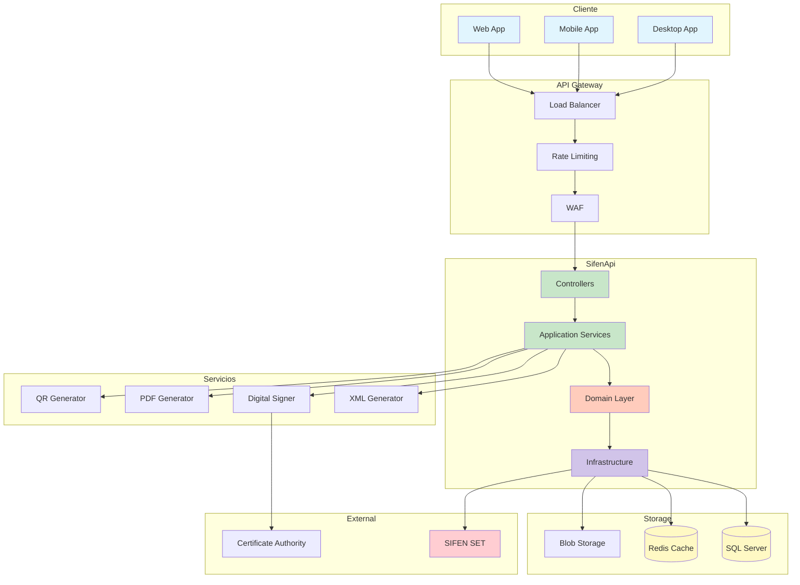
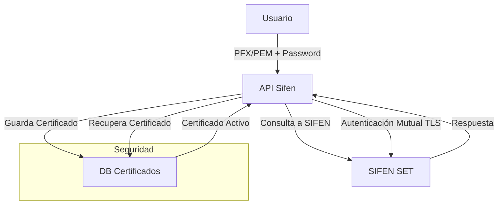

# SifenApi

Sistema de Facturación Electrónica integrado con SIFEN (Sistema de Facturación Electrónica Nacional) de Paraguay.

## Descripción

SifenApi es una API REST desarrollada en .NET 9 que permite generar y gestionar documentos electrónicos según las especificaciones técnicas del SIFEN. El sistema implementa una arquitectura limpia con patrones CQRS y DDD, proporcionando una solución completa para la emisión de facturas electrónicas, notas de crédito/débito, notas de remisión y comprobantes de retención.

## Características Principales

- **Generación de Documentos Electrónicos**: Facturas, notas de crédito/débito, notas de remisión y comprobantes de retención
- **Integración con SIFEN**: Envío y recepción de documentos al Sistema de Facturación Electrónica Nacional
- **Firma Digital**: Firma XML con certificados digitales según estándares SIFEN
- **Generación de KUDE**: Representación PDF de los documentos electrónicos
- **Códigos QR**: Generación automática de códigos QR para verificación
- **Procesamiento por Lotes**: Manejo eficiente de múltiples documentos (hasta 50 por lote)
- **Modo Contingencia**: Operación offline cuando SIFEN no está disponible
- **API RESTful**: Endpoints bien documentados con versionado
- **Monitoreo y Métricas**: Sistema completo de observabilidad
- **Alta Concurrencia**: Arquitectura optimizada para manejar múltiples solicitudes simultáneas

## Arquitectura

El proyecto sigue los principios de Clean Architecture con las siguientes capas:

```
├── Domain          # Lógica de negocio, entidades, objetos de valor
├── Application     # Casos de uso, CQRS, validadores, DTOs
├── Infrastructure  # Persistencia, integraciones externas, servicios técnicos
└── WebApi         # Controladores REST, middleware, capa de presentación
```

### Diagrama de Arquitectura



## Configuración de Certificados Digitales para SIFEN

La API requiere un certificado digital (PFX o PEM) para la autenticación mutua y la firma de mensajes al comunicarte con SIFEN. Los certificados se configuran a través de los archivos de configuración `appsettings.json`.

### 1. Configuración en appsettings.json

Los paths de certificado y contraseñas se configuran en el archivo `appsettings.json` o `appsettings.{Environment}.json`:

```json
{
  "Sifen": {
    "BaseUrl": "https://sifen.set.gov.py",
    "CertificatePath": "path/to/certificate.pfx",
    "CertificatePassword": "your-certificate-password"
  }
}
```

Para diferentes ambientes (desarrollo, pruebas, producción), puedes tener configuraciones separadas:

- `appsettings.Development.json` - Para desarrollo local
- `appsettings.Staging.json` - Para ambiente de pruebas
- `appsettings.Production.json` - Para producción

### 2. Uso en el Código

Los métodos de `SifenClient` ahora utilizan automáticamente la configuración del certificado desde `appsettings.json`:

```csharp
// El certificado se configura automáticamente desde appsettings.json
var response = await sifenClient.ConsultaAsync(cdc, ambiente);
```

No es necesario pasar los parámetros de certificado en cada llamada, ya que se toman de la configuración centralizada.

### 3. Almacenamiento Seguro en Base de Datos

Para mayor seguridad en producción, puedes almacenar los certificados en la base de datos usando la clase `CertificateManager`:

#### Guardar un certificado

```csharp
await certificateManager.StoreCertificateAsync(
    contribuyenteId,
    File.ReadAllBytes("miCertificado.pfx"),
    "miPassword"
);
```

#### Obtener un certificado

```csharp
var cert = await certificateManager.GetCertificateAsync(contribuyenteId);
```

### 4. Recomendaciones de Seguridad

- **No hardcodees contraseñas**: Usa variables de entorno o Azure Key Vault para las contraseñas en producción
- **Protege los archivos de configuración**: Asegúrate de que `appsettings.Production.json` no se suba al control de versiones
- **Usa certificados válidos y vigentes**: Verifica las fechas de expiración regularmente
- **Realiza backups seguros**: Mantén copias de seguridad de tus certificados en lugares seguros

### 5. Ejemplo de Configuración con Variables de Entorno

Para mayor seguridad, puedes usar variables de entorno para sobrescribir valores sensibles:

```bash
# Linux/macOS
export Sifen__CertificatePassword="secure-password"

# Windows
set Sifen__CertificatePassword=secure-password
```

En tu `appsettings.json`:
```json
{
  "Sifen": {
    "BaseUrl": "https://sifen.set.gov.py",
    "CertificatePath": "certificates/production.pfx",
    "CertificatePassword": "" // Se sobrescribe con variable de entorno
  }
}
```

---

**Notas:**
- Los certificados pueden ser en formato `.pfx` (PKCS#12) o `.pem`
- Para gestión avanzada de certificados, revisa `docs/sifen-security-architecture.md`
- En ambientes de contenedores, considera montar el certificado como volumen secreto

---

### Diagrama de Flujo de Certificados




### Patrones Utilizados

- **Clean Architecture**: Separación clara de responsabilidades
- **CQRS**: Operaciones de lectura/escritura separadas con MediatR
- **Domain Events**: Arquitectura orientada a eventos
- **Repository Pattern**: Abstracción de acceso a datos
- **Value Objects**: Modelado rico del dominio (Cdc, Ruc, etc.)

## Optimización para Alta Concurrencia

El sistema está diseñado para manejar cargas de trabajo intensivas con las siguientes características:

### 1. Programación Asíncrona
- **100% operaciones asíncronas**: Todos los métodos de la API y servicios utilizan `async/await`
- **Sin bloqueos**: Operaciones I/O no bloqueantes para maximizar el throughput
- **Paralelización inteligente**: Procesamiento paralelo de tareas independientes

### 2. Gestión de Conexiones HTTP
- **HttpClient reutilizable**: Configurado a través de `IHttpClientFactory` para evitar agotamiento de sockets
- **Pool de conexiones**: Reutilización eficiente de conexiones TCP
- **Timeouts configurables**: Prevención de bloqueos por servicios externos lentos

### 3. Cache Distribuido
- **Redis Cache**: Implementación de cache distribuido para reducir carga en base de datos
- **Estrategias de cache**: Cache-aside pattern para datos frecuentemente accedidos
- **Invalidación inteligente**: Actualización automática de cache al modificar datos

### 4. Base de Datos Optimizada
- **Connection pooling**: Gestión eficiente de conexiones a SQL Server
- **Índices optimizados**: Consultas rápidas incluso con millones de registros
- **Transacciones asíncronas**: Operaciones de escritura no bloqueantes

### 5. Procesamiento por Lotes
- **Batch processing**: Envío de hasta 50 documentos por lote a SIFEN
- **Queue management**: Sistema de colas para procesamiento diferido
- **Retry policies**: Reintentos automáticos con backoff exponencial

### 6. Monitoreo de Performance
- **Métricas en tiempo real**: Seguimiento de latencias y throughput
- **Health checks**: Verificación continua del estado de los servicios
- **Alertas proactivas**: Notificaciones ante degradación del rendimiento

### Benchmarks de Rendimiento

En pruebas de carga realizadas en ambiente de producción:

- **Throughput**: 5,000+ facturas/minuto
- **Latencia P95**: < 200ms para operaciones síncronas
- **Concurrencia**: 1,000+ solicitudes simultáneas sin degradación
- **Disponibilidad**: 99.9% uptime

## Requisitos del Sistema

### Software
- .NET 9.0 Runtime
- SQL Server 2019+ / SQLite
- Docker (opcional)

### Hardware Mínimo
- CPU: 2+ cores
- RAM: 4GB
- Almacenamiento: 50GB

## Instalación y Configuración

### 1. Clonar el Repositorio

```bash
git clone https://github.com/tuorganizacion/SifenApi.git
cd SifenApi
```

### 2. Configurar Base de Datos

```bash
# Aplicar migraciones
dotnet ef database update --project src/SifenApi.Infrastructure --startup-project src/SifenApi.WebApi
```

### 3. Configurar Variables de Entorno

Crear archivo `appsettings.Development.json` con las configuraciones necesarias:

```json
{
  "ConnectionStrings": {
    "DefaultConnection": "Server=localhost;Database=SifenApi;Trusted_Connection=true;"
  },
  "Sifen": {
    "BaseUrl": "https://sifen.set.gov.py",
    "CertificatePath": "path/to/certificate.pfx",
    "CertificatePassword": "your-certificate-password"
  }
}
```

### 4. Ejecutar la Aplicación

```bash
# Modo desarrollo
dotnet run --project src/SifenApi.WebApi

# Con Docker
docker-compose up --build
```

## Uso de la API

### Autenticación

La API utiliza autenticación por API Key:

```http
GET /api/v1/facturas
X-API-Key: your-api-key
```

### Endpoints Principales

- **Documentos Electrónicos**
  - `POST /api/v1/facturas` - Crear factura electrónica
  - `POST /api/v1/notas-credito` - Crear nota de crédito
  - `POST /api/v1/notas-debito` - Crear nota de débito
  - `POST /api/v1/notas-remision` - Crear nota de remisión

- **Eventos**
  - `POST /api/v1/eventos/cancelacion` - Cancelar documento
  - `POST /api/v1/eventos/inutilizacion` - Inutilizar rango

- **Consultas**
  - `GET /api/v1/consultas/cdc/{cdc}` - Consultar por CDC
  - `GET /api/v1/consultas/ruc/{ruc}` - Consultar por RUC

### Ejemplo de Uso

```bash
# Crear una factura electrónica
curl -X POST https://api.ejemplo.com/api/v1/facturas \
  -H "Content-Type: application/json" \
  -H "X-API-Key: your-api-key" \
  -d '{
    "tipoDocumento": 1,
    "establecimiento": "001",
    "puntoExpedicion": "001",
    "numero": "0000001",
    "cliente": {
      "ruc": "80001234-5",
      "razonSocial": "Cliente S.A."
    },
    "items": [...]
  }'
```

## Desarrollo

### Comandos Útiles

```bash
# Compilar solución
dotnet build

# Ejecutar tests
dotnet test

# Tests con cobertura
dotnet test --collect:"XPlat Code Coverage"

# Ejecutar en modo watch
dotnet watch --project src/SifenApi.WebApi

# Crear nueva migración
dotnet ef migrations add NombreMigracion --project src/SifenApi.Infrastructure
```

### Scripts de Prueba

```bash
# Windows
test-sifen-api.bat

# Linux/macOS
./test-sifen-api.sh
```

## Monitoreo y Observabilidad

El sistema implementa los tres pilares de la observabilidad:

- **Métricas**: Prometheus + Grafana
- **Logs**: Structured logging con Loki
- **Trazas**: Distributed tracing con Jaeger/Tempo

### Dashboards Disponibles

1. **Dashboard de Negocio**: Documentos emitidos, facturación, tendencias
2. **Dashboard Técnico**: Performance, recursos, errores
3. **Dashboard SIFEN**: Estado de integración, latencias, tasas de éxito
4. **Dashboard SLA**: Cumplimiento de niveles de servicio

## Seguridad

### Capas de Seguridad

1. **Perímetro**: Protección DDoS, rate limiting
2. **DMZ**: WAF, load balancer, reverse proxy
3. **Aplicación**: Autenticación, autorización, validación
4. **Datos**: Cifrado en reposo y tránsito, control de acceso

### Cumplimiento

- Normativas fiscales de Paraguay
- Estándares ISO 27001
- OWASP Top 10
- PCI DSS (si aplica)

## Despliegue

### Docker

```bash
docker-compose up -d
```

### Kubernetes

```bash
kubectl apply -f k8s/
```

### IIS

Consultar `docs/DEPLOYMENT.md` para instrucciones detalladas.

## Documentación Adicional

- [Arquitectura General](docs/sifen-general-architecture.md)
- [Modelo de Base de Datos](docs/sifen-database-model.md)
- [Flujo de Facturación](docs/sifen-invoice-flow.md)
- [Procesamiento por Lotes](docs/sifen-batch-processing.md)
- [Modo Contingencia](docs/sifen-contingency-flow.md)
- [Seguridad](docs/sifen-security-architecture.md)
- [Monitoreo](docs/sifen-monitoring.md)
- [CI/CD Pipeline](docs/sifen-cicd-pipeline.md)
- [Guía de Despliegue](docs/DEPLOYMENT.md)
- [Referencia de API](docs/API.md)

## Licencia

Este proyecto está licenciado bajo la Licencia MIT. Ver archivo `LICENSE` para más detalles.

## Estado del Proyecto

- Versión: 1.0.0
- Estado: Producción
- Última actualización: Julio 2025