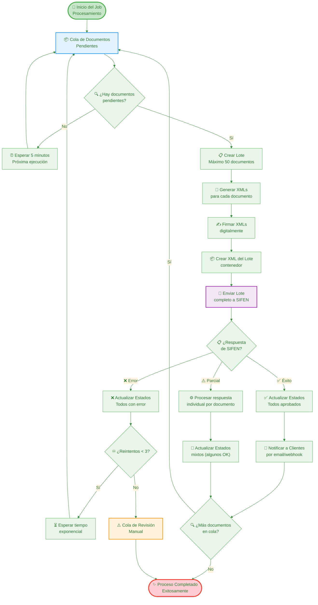

# SIFEN - Flujo de Procesamiento por Lotes

## Diagrama de Flujo de Procesamiento por Lotes

Este diagrama muestra el proceso completo de procesamiento por lotes de documentos electrónicos.



## Descripción del Proceso

### 🚀 Inicio del Procesamiento
El job de procesamiento por lotes se ejecuta de forma programada (por ejemplo, cada 5 minutos) para procesar documentos electrónicos pendientes.

**Configuración típica**:
- Frecuencia: Cada 5 minutos
- Tamaño máximo de lote: 50 documentos
- Timeout por lote: 2 minutos
- Máximo de reintentos: 3

### 📦 Gestión de Cola de Documentos

#### Criterios de Selección
Los documentos se seleccionan para procesamiento basado en:
- **Estado**: Solo documentos en estado "Pendiente" o "Error" (con reintentos disponibles)
- **Prioridad**: Documentos más antiguos primero (FIFO)
- **Tipo**: Se pueden priorizar ciertos tipos de documento
- **Contribuyente**: Balance de carga por contribuyente

#### Límites del Lote
- **Tamaño máximo**: 50 documentos por lote
- **Tamaño mínimo**: 1 documento (no esperar si hay pocos)
- **Timeout**: Máximo 2 minutos de procesamiento por lote

### 📄 Generación de XMLs
Para cada documento en el lote:
1. **Obtener datos**: Recuperar información completa del documento
2. **Generar XML**: Crear XML según especificaciones SIFEN
3. **Validar**: Verificar que el XML cumpla con el esquema
4. **Cache**: Guardar XML generado para auditoría

### ✍️ Firmado Digital
1. **Obtener certificado**: Recuperar certificado digital vigente
2. **Firmar cada XML**: Aplicar firma digital a cada documento
3. **Validar firma**: Verificar que la firma sea válida
4. **Timestamp**: Aplicar sello de tiempo si es requerido

### 📦 Creación del Lote Contenedor
1. **XML del lote**: Crear XML que contiene todos los documentos
2. **Metadatos**: Incluir información del lote (fecha, cantidad, etc.)
3. **Firmar lote**: Aplicar firma digital al lote completo
4. **Validar**: Verificar integridad del lote

### 🚀 Envío a SIFEN
1. **Endpoint**: Usar servicio web SOAP de SIFEN
2. **Autenticación**: Incluir credenciales del contribuyente
3. **Transmisión**: Enviar el lote completo
4. **Timeout**: Esperar respuesta con timeout configurado

## Tipos de Respuesta de SIFEN

### ✅ Éxito Completo
**Descripción**: Todos los documentos del lote fueron aprobados.

**Acciones**:
1. Actualizar estado de todos los documentos a "Aprobado"
2. Guardar número de protocolo de SIFEN
3. Generar eventos de aprobación
4. Notificar a clientes via email/webhook

### ❌ Error Completo
**Descripción**: Todos los documentos del lote fueron rechazados.

**Acciones**:
1. Actualizar estado de todos los documentos a "Error"
2. Guardar mensaje de error de SIFEN
3. Incrementar contador de reintentos
4. Decidir si reintentar o enviar a revisión manual

### ⚠️ Respuesta Parcial
**Descripción**: Algunos documentos aprobados, otros rechazados.

**Acciones**:
1. Procesar respuesta documento por documento
2. Actualizar estados individualmente
3. Guardar detalles específicos de cada documento
4. Notificar solo los documentos aprobados

## Estrategia de Reintentos

### Condiciones para Reintento
- Error de comunicación (timeout, conexión perdida)
- Error temporal de SIFEN (servidor ocupado)
- Errores recoverable del sistema

### Algoritmo de Backoff Exponencial
```
Intento 1: Inmediatamente
Intento 2: 30 segundos
Intento 3: 90 segundos
Intento 4: 270 segundos (4.5 minutos)
```

### Cola de Revisión Manual
Documentos que van a revisión manual:
- 3 reintentos fallidos
- Errores de validación críticos
- Problemas con certificados digitales
- Errores de configuración

## Notificaciones a Clientes

### 📧 Email
- Factura aprobada con PDF adjunto
- Notificación de error con detalles
- Resumen diario/semanal

### 🌐 Webhooks
- Evento de documento aprobado
- Evento de documento rechazado
- Payload JSON con detalles completos

### 📱 Push Notifications
- Notificación inmediata para aplicaciones móviles
- Estado de procesamiento en tiempo real

## Monitoreo y Métricas

### 📊 Métricas Clave
- **Throughput**: Documentos procesados por minuto
- **Latencia**: Tiempo promedio de procesamiento por lote
- **Error rate**: Porcentaje de documentos rechazados
- **Retry rate**: Porcentaje de documentos que requieren reintento

### 🚨 Alertas
- Lotes fallando consecutivamente
- Tiempo de procesamiento excesivo
- Cola de documentos creciendo continuamente
- SIFEN no responde por tiempo prolongado

### 📝 Logging
- Log detallado de cada lote procesado
- Errores específicos por documento
- Tiempos de respuesta de SIFEN
- Estadísticas de reintentos