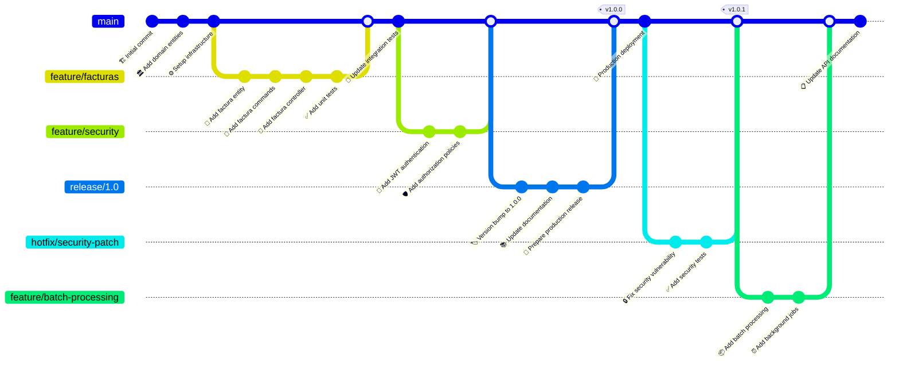

# SIFEN - Pipeline de CI/CD

## Diagrama de Git Flow y Pipeline

Este diagrama muestra el flujo de desarrollo, branching strategy y pipeline de deployment del proyecto SIFEN.



## Estrategia de Branching

### 📋 Branch Types y Propósito

#### 🏗️ Main Branch
- **Propósito**: Código estable en producción
- **Protección**: Requiere PR review y CI passing
- **Deploy**: Automático a producción
- **Naming**: `main`

#### 🚀 Feature Branches
- **Propósito**: Desarrollo de nuevas funcionalidades
- **Origen**: Derivado de `main`
- **Naming**: `feature/nombre-descriptivo`
- **Lifetime**: Hasta merge a `main`

#### 🔄 Release Branches
- **Propósito**: Preparación de versiones
- **Origen**: Derivado de `main`
- **Naming**: `release/x.y.z`
- **Actividades**: Bug fixes menores, versioning, docs

#### 🔧 Hotfix Branches
- **Propósito**: Correcciones urgentes en producción
- **Origen**: Derivado de `main`
- **Naming**: `hotfix/descripcion-fix`
- **Merge**: Directo a `main` con tag de versión

#### 🧪 Development Branch (Opcional)
- **Propósito**: Integración continua de features
- **Uso**: Para proyectos con releases menos frecuentes
- **Naming**: `develop`

## CI/CD Pipeline Stages

### 🔍 Stage 1: Code Quality & Testing

#### Análisis Estático
```yaml
static_analysis:
  runs-on: ubuntu-latest
  steps:
    - uses: actions/checkout@v3
    - name: Setup .NET
      uses: actions/setup-dotnet@v3
      with:
        dotnet-version: '8.0'
    - name: SonarCloud Scan
      run: dotnet sonarscanner begin
    - name: Build
      run: dotnet build
    - name: SonarCloud Analysis
      run: dotnet sonarscanner end
```

#### Unit Tests
```yaml
unit_tests:
  runs-on: ubuntu-latest
  steps:
    - name: Run Unit Tests
      run: dotnet test --no-build --verbosity normal --collect:"XPlat Code Coverage"
    - name: Upload Coverage
      uses: codecov/codecov-action@v3
```

#### Integration Tests
```yaml
integration_tests:
  runs-on: ubuntu-latest
  services:
    postgres:
      image: postgres:15
    redis:
      image: redis:alpine
  steps:
    - name: Run Integration Tests
      run: dotnet test tests/SIFEN.IntegrationTests
```

### 🏗️ Stage 2: Build & Package

#### Docker Build
```yaml
build:
  runs-on: ubuntu-latest
  steps:
    - name: Build Docker Image
      run: |
        docker build -t sifen-api:${{ github.sha }} .
        docker build -t sifen-api:latest .
    - name: Push to Registry
      run: |
        docker push sifen-api:${{ github.sha }}
        docker push sifen-api:latest
```

#### Artifact Generation
- **API Package**: Docker image con la aplicación
- **Database Scripts**: Migraciones y seed data
- **Configuration**: Templates de configuración
- **Documentation**: API docs generados

### 🚀 Stage 3: Deployment

#### Development Environment
```yaml
deploy_dev:
  if: github.ref == 'refs/heads/main'
  environment: development
  steps:
    - name: Deploy to Dev
      run: kubectl apply -f k8s/dev/
    - name: Run Smoke Tests
      run: ./scripts/smoke-tests.sh $DEV_URL
```

#### Staging Environment
```yaml
deploy_staging:
  if: startsWith(github.ref, 'refs/tags/')
  environment: staging
  steps:
    - name: Deploy to Staging
      run: kubectl apply -f k8s/staging/
    - name: Run E2E Tests
      run: npm run test:e2e
```

#### Production Environment
```yaml
deploy_production:
  environment: production
  steps:
    - name: Deploy to Production
      run: |
        kubectl set image deployment/sifen-api sifen-api=sifen-api:${{ github.sha }}
        kubectl rollout status deployment/sifen-api
    - name: Run Health Check
      run: ./scripts/health-check.sh $PROD_URL
```

## Automation & Quality Gates

### ✅ Quality Gates

#### 📊 Coverage Requirements
- **Unit Tests**: Mínimo 80% coverage
- **Integration Tests**: Cobertura de APIs críticas
- **E2E Tests**: Flujos principales de negocio

#### 🔍 Security Scans
- **SAST**: Static Application Security Testing
- **Dependency Scan**: Vulnerabilidades en dependencias
- **Container Scan**: Análisis de imágenes Docker
- **DAST**: Dynamic Application Security Testing (staging)

#### 📈 Performance Tests
- **Load Testing**: k6 scripts en staging
- **Stress Testing**: Límites de capacidad
- **Endurance Testing**: Pruebas prolongadas

### 🛡️ Branch Protection Rules

#### Main Branch Protection
```json
{
  "required_status_checks": {
    "strict": true,
    "contexts": [
      "ci/unit-tests",
      "ci/integration-tests",
      "ci/security-scan",
      "ci/build"
    ]
  },
  "enforce_admins": true,
  "required_pull_request_reviews": {
    "required_approving_review_count": 2,
    "dismiss_stale_reviews": true,
    "require_code_owner_reviews": true
  }
}
```

## Environments & Configuration

### 🏗️ Environment Strategy

#### Development
- **Purpose**: Desarrollo activo
- **Data**: Datos sintéticos
- **Config**: Modo debug habilitado
- **Deploy**: Automático en cada merge a main

#### Staging
- **Purpose**: Testing pre-producción
- **Data**: Copia anonimizada de producción
- **Config**: Configuración similar a producción
- **Deploy**: Manual con aprobación

#### Production
- **Purpose**: Ambiente productivo
- **Data**: Datos reales de clientes
- **Config**: Optimizado para performance
- **Deploy**: Manual con múltiples aprobaciones

### ⚙️ Configuration Management

#### Environment Variables
```bash
# Database
DATABASE_CONNECTION_STRING
REDIS_CONNECTION_STRING

# SIFEN Integration
SIFEN_ENDPOINT
SIFEN_CERTIFICATE_PATH
SIFEN_TIMEOUT

# Security
JWT_SECRET_KEY
ENCRYPTION_KEY

# Monitoring
SENTRY_DSN
ELASTIC_URL
```

#### Secrets Management
- **Azure Key Vault** para secretos de producción
- **GitHub Secrets** para CI/CD
- **Kubernetes Secrets** para configuración runtime

## Deployment Strategies

### 🔄 Rolling Deployment
- **Default strategy** para la mayoría de deployments
- **Zero downtime** garantizado
- **Gradual rollout** con health checks
- **Automatic rollback** en caso de falla

### 🔵🟢 Blue-Green Deployment
- **Para releases mayores** con cambios significativos
- **Validation completa** en ambiente green
- **Switch instantáneo** con DNS/Load Balancer
- **Rollback inmediato** si hay problemas

### 🐢 Canary Deployment
- **Para features experimentales**
- **Traffic splitting** (5% canary, 95% stable)
- **Metrics monitoring** para validación
- **Progressive rollout** basado en métricas

## Monitoring & Observability

### 📊 Pipeline Metrics
- **Build time**: Duración promedio de builds
- **Test success rate**: Porcentaje de tests passing
- **Deployment frequency**: Frecuencia de deployments
- **Lead time**: Tiempo desde commit hasta producción
- **MTTR**: Mean Time To Recovery de incidentes

### 🚨 Alerting
- **Pipeline failures**: Notificación inmediata
- **Security vulnerabilities**: Alertas críticas
- **Performance degradation**: Monitoreo continuo
- **Deployment issues**: Notificaciones de rollback

### 📈 Dashboards
- **Pipeline Status**: Estado actual de builds
- **Quality Metrics**: Coverage, bugs, technical debt
- **Performance Trends**: Tiempo de build y deploy
- **Security Posture**: Vulnerabilidades encontradas

## Best Practices

### 👥 Team Practices
- **Small commits**: Commits frecuentes y pequeños
- **Meaningful messages**: Mensajes descriptivos
- **PR templates**: Templates para pull requests
- **Code reviews**: Revisión obligatoria por pares

### 🔒 Security Practices
- **Signed commits**: Verificación de autoría
- **Dependency updates**: Actualizaciones regulares
- **Security scanning**: En cada pipeline run
- **Secret rotation**: Rotación periódica de secrets

### 📋 Release Practices
- **Semantic versioning**: Versionado semántico
- **Changelog**: Documentación de cambios
- **Release notes**: Notas detalladas para usuarios
- **Rollback plan**: Plan de rollback documentado