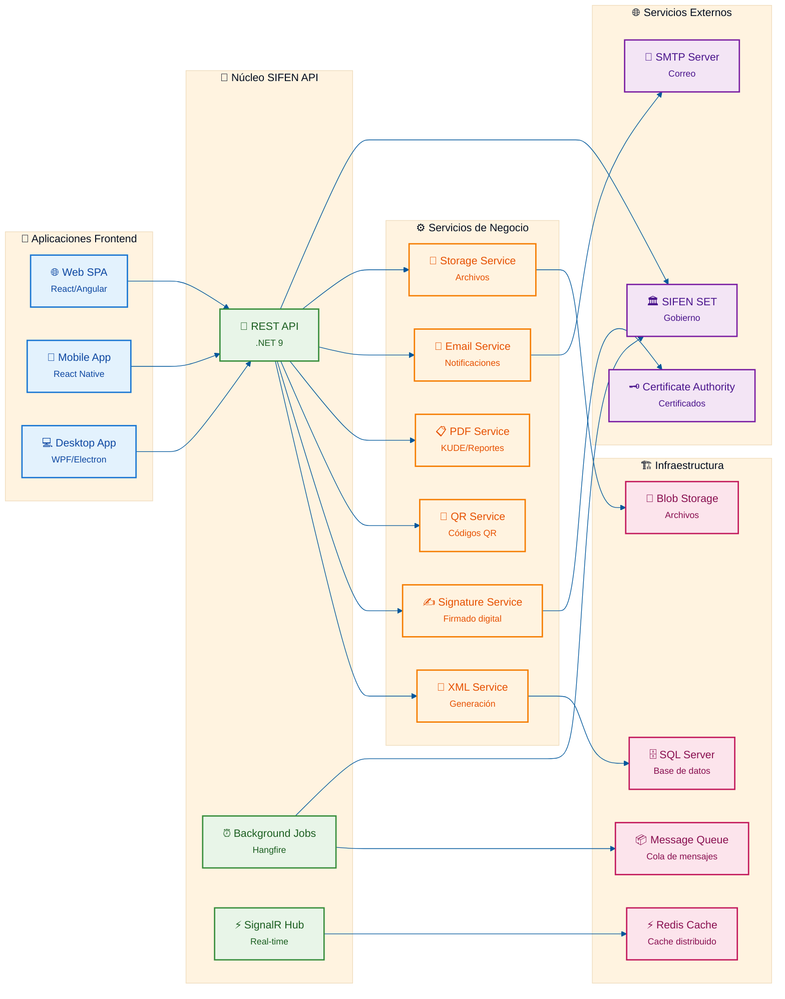

# SIFEN - Arquitectura de Componentes

## Diagrama de Componentes del Sistema

Este diagrama muestra la arquitectura de componentes con las aplicaciones frontend, el núcleo de la API, servicios de negocio e infraestructura.

## Descripción de los Componentes

### 📱 Aplicaciones Frontend

#### 🌐 Web SPA (Single Page Application)
- **Tecnología**: React/Angular
- **Propósito**: Interfaz web para usuarios finales
- **Características**:
  - Interfaz responsive
  - Comunicación REST con la API
  - Autenticación JWT
  - Real-time updates vía SignalR

#### 📱 Mobile App
- **Tecnología**: React Native
- **Propósito**: Aplicación móvil multiplataforma
- **Características**:
  - Funcionalidad offline
  - Notificaciones push
  - Escaneado de códigos QR
  - Sincronización con la API

#### 💻 Desktop App
- **Tecnología**: WPF/Electron
- **Propósito**: Aplicación de escritorio para POS
- **Características**:
  - Integración con hardware (impresoras, lectores)
  - Funcionalidad offline
  - Sincronización por lotes
  - Interface nativa del SO

### 🚀 Núcleo SIFEN API

#### 🎯 REST API
- **Tecnología**: .NET 9
- **Propósito**: API principal del sistema
- **Responsabilidades**:
  - Endpoints REST para todas las operaciones
  - Autenticación y autorización
  - Validación de datos
  - Orquestación de servicios de negocio

#### ⏰ Background Jobs
- **Tecnología**: Hangfire
- **Propósito**: Procesamiento asíncrono
- **Responsabilidades**:
  - Procesamiento de documentos en lotes
  - Reintento de operaciones fallidas
  - Tareas programadas
  - Procesamiento en modo contingencia

#### ⚡ SignalR Hub
- **Tecnología**: SignalR
- **Propósito**: Comunicación en tiempo real
- **Responsabilidades**:
  - Notificaciones push a clientes
  - Actualizaciones de estado en tiempo real
  - Mensajería bidireccional
  - Gestión de conexiones

### ⚙️ Servicios de Negocio

#### 📄 XML Service
- **Propósito**: Generación de XMLs SIFEN
- **Responsabilidades**:
  - Generar XML según especificaciones SIFEN
  - Validar estructura XML
  - Aplicar transformaciones XSL
  - Cache de templates XML

#### ✍️ Signature Service
- **Propósito**: Firmado digital de documentos
- **Responsabilidades**:
  - Firmar XMLs con certificados digitales
  - Validar certificados
  - Gestionar almacén de certificados
  - Verificar firmas digitales

#### 📱 QR Service
- **Propósito**: Generación de códigos QR
- **Responsabilidades**:
  - Generar códigos QR según formato SIFEN
  - Configurar nivel de corrección de errores
  - Optimizar tamaño y calidad
  - Cache de códigos generados

#### 📋 PDF Service
- **Propósito**: Generación de PDFs KUDE
- **Responsabilidades**:
  - Generar PDFs según formato KUDE
  - Aplicar templates personalizados
  - Incluir códigos QR y firmas
  - Optimizar tamaño de archivos

#### 📧 Email Service
- **Propósito**: Envío de notificaciones por correo
- **Responsabilidades**:
  - Enviar facturas por correo
  - Notificaciones de estado
  - Templates de correo
  - Cola de envío con reintentos

#### 💾 Storage Service
- **Propósito**: Gestión de archivos
- **Responsabilidades**:
  - Almacenar PDFs y XMLs
  - Gestionar versiones de archivos
  - Compresión y optimización
  - Backup y recuperación

### 🏗️ Infraestructura

#### 🗄️ SQL Server
- **Propósito**: Base de datos principal
- **Características**:
  - Almacenamiento transaccional
  - Integridad referencial
  - Backup automático
  - Alta disponibilidad

#### ⚡ Redis Cache
- **Propósito**: Cache distribuido
- **Usos**:
  - Cache de sesiones
  - Cache de datos frecuentes
  - Lock distribuido
  - Message broker

#### 📁 Blob Storage
- **Propósito**: Almacenamiento de archivos
- **Contenido**:
  - PDFs generados
  - XMLs firmados
  - Certificados digitales
  - Logs de sistema

#### 📦 Message Queue
- **Propósito**: Cola de mensajes
- **Usos**:
  - Procesamiento asíncrono
  - Desacoplamiento de servicios
  - Garantía de entrega
  - Load balancing

### 🌐 Servicios Externos

#### 🏛️ SIFEN SET
- **Propósito**: Sistema de la SET
- **Comunicación**: SOAP/XML
- **Servicios**:
  - Envío de documentos
  - Consulta de estados
  - Eventos de cancelación
  - Validaciones

#### 📧 SMTP Server
- **Propósito**: Servidor de correo
- **Configuración**:
  - Relay SMTP
  - Autenticación
  - Cifrado TLS
  - Rate limiting

#### 🗝 Certificate Authority
- **Propósito**: Autoridad certificadora
- **Servicios**:
  - Emisión de certificados
  - Validación de certificados
  - Lista de revocación (CRL)
  - Timestamping

## Patrones de Comunicación

### 🔄 Comunicación Síncrona
- Frontend → REST API
- REST API → Servicios de Negocio
- Servicios → Base de Datos

### ⚡ Comunicación Asíncrona
- Background Jobs → Message Queue
- SignalR Hub → Clientes Frontend
- Email Service → SMTP Server

### 🔒 Seguridad
- JWT tokens para autenticación
- HTTPS para todas las comunicaciones
- Certificados digitales para firmado
- Rate limiting y throttling