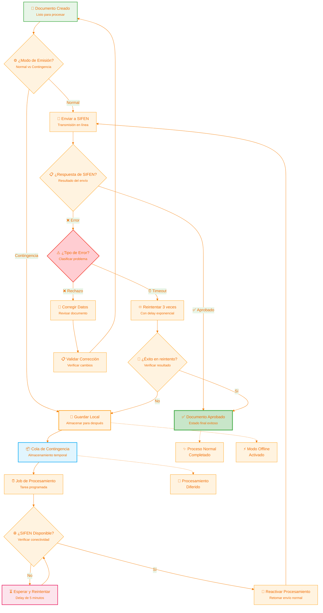

# SIFEN - Flujo de Contingencia

## Diagrama de Flujo de Contingencia

Este diagrama muestra el manejo de documentos electrónicos cuando el sistema SIFEN no está disponible o hay problemas de conectividad.



## Descripción del Flujo de Contingencia

### 📋 Detección de Necesidad de Contingencia

#### Criterios de Activación
El modo contingencia se activa cuando ocurre alguno de estos eventos:

1. **Timeout de SIFEN**: No hay respuesta en tiempo límite (30 segundos)
2. **Error de Conectividad**: Problemas de red o DNS
3. **Error de Servicio**: SIFEN retorna errores de servidor (5xx)
4. **Mantenimiento**: Ventana de mantenimiento programado
5. **Sobrecarga**: SIFEN indica que está ocupado

#### Detección Automática
```
- Health check cada 30 segundos
- 3 fallos consecutivos = modo contingencia
- Notificación automática al equipo
- Dashboard actualizado en tiempo real
```

### 💾 Almacenamiento Local de Contingencia

#### Estructura de Datos
Los documentos en contingencia se almacenan con:
- **Timestamp**: Momento de creación
- **Prioridad**: Normal, Alta, Crítica
- **Reintentos**: Contador de intentos fallidos
- **Estado**: Pendiente, Reintentando, Error
- **Metadata**: Información adicional del documento

#### Base de Datos Local
```sql
CREATE TABLE DocumentosContingencia (
    Id GUID PRIMARY KEY,
    DocumentoElectronicoId GUID,
    FechaCreacion DATETIME,
    Prioridad INT,
    NumeroReintentos INT,
    Estado VARCHAR(50),
    UltimoIntento DATETIME,
    ProximoIntento DATETIME,
    MensajeError NVARCHAR(MAX)
)
```

### 📦 Cola de Contingencia

#### Gestión de Prioridades
1. **Crítica**: Documentos urgentes (facturas de emergencia)
2. **Alta**: Documentos con deadline próximo
3. **Normal**: Documentos regulares

#### Políticas de Cola
- **FIFO por prioridad**: Crítica → Alta → Normal
- **Aging**: Documentos antiguos suben prioridad
- **Balancing**: Distribución equitativa por contribuyente
- **Throttling**: Límite de documentos por contribuyente/hora

### ⏰ Job de Procesamiento de Contingencia

#### Configuración del Job
```json
{
  "frecuencia": "cada 5 minutos",
  "loteMaximo": 25,
  "timeoutPorDocumento": 10,
  "reintentoMaximo": 3,
  "backoffExponencial": true
}
```

#### Proceso de Ejecución
1. **Verificación de conectividad**: Health check de SIFEN
2. **Selección de documentos**: Por prioridad y tiempo
3. **Procesamiento en lotes**: Grupos de hasta 25 documentos
4. **Actualización de estado**: Éxito, error o reintento

### 🌐 Verificación de Disponibilidad SIFEN

#### Health Check Endpoint
```http
GET https://sifen.set.gov.py/health
Headers:
  - User-Agent: SIFEN-API/1.0
  - Accept: application/json

Response:
{
  "status": "UP",
  "timestamp": "2024-01-15T10:30:00Z",
  "services": {
    "facturation": "UP",
    "batch": "UP",
    "queries": "UP"
  }
}
```

#### Criterios de Disponibilidad
- **Response time** < 5 segundos
- **Status** = "UP"
- **Services** críticos operativos
- **Sin errores** de conectividad

### 🔄 Reactivación del Procesamiento Normal

#### Transición Gradual
1. **Test batch**: Enviar lote pequeño (5 documentos)
2. **Verificación**: Confirmar procesamiento exitoso
3. **Escalado**: Incrementar tamaño de lotes gradualmente
4. **Monitoreo**: Verificar estabilidad por 15 minutos
5. **Full restore**: Reactivación completa

#### Priorización en Reactivación
1. **Documentos críticos** primero
2. **Documentos más antiguos** después
3. **Balanceado por contribuyente**
4. **Procesamiento normal** último

## Estrategias de Reintento

### ⏰ Algoritmo de Backoff Exponencial

#### Configuración Base
```
Intento 1: Inmediato
Intento 2: 30 segundos
Intento 3: 90 segundos (1.5 min)
Intento 4: 270 segundos (4.5 min)
Intento 5: 810 segundos (13.5 min)
```

#### Factores de Ajuste
- **Jitter**: +/- 10% aleatorio para evitar thundering herd
- **Priority multiplier**: Documentos críticos con menor delay
- **Load factor**: Ajuste basado en carga del sistema

### ❌ Manejo de Errores Persistentes

#### Clasificación de Errores
1. **Recuperables**: Timeout, sobrecarga, conectividad
2. **No recuperables**: Validación, autenticación, formato
3. **Temporal**: Mantenimiento, degradación de servicio
4. **Permanente**: Documento inválido, certificado vencido

#### Acciones por Tipo
- **Recuperables**: Reintento con backoff
- **No recuperables**: Marcar como error permanente
- **Temporal**: Esperar y reintentar
- **Permanente**: Requiere intervención manual

## Notificaciones y Alertas

### 🚨 Alertas Críticas
- **Activación de contingencia**: Notificación inmediata
- **Cola creciendo**: Más de 100 documentos pendientes
- **Reintentos agotados**: Documentos requieren intervención
- **SIFEN down**: Tiempo prolongado sin conectividad

### 📧 Notificaciones a Usuarios
- **Email de contingencia**: Informar modo offline activado
- **SMS crítico**: Para documentos urgentes
- **Push notification**: Actualización de estado en apps
- **Dashboard update**: Indicador visual de estado

### 📊 Métricas de Contingencia
- **Documentos en cola**: Cantidad actual pendiente
- **Tiempo promedio en cola**: Latencia de procesamiento
- **Tasa de éxito**: Porcentaje procesado exitosamente
- **Disponibilidad SIFEN**: Uptime del servicio externo

## Configuración y Parámetros

### ⚙️ Parámetros Configurables
```json
{
  "contingencia": {
    "healthCheckInterval": 30,
    "maxRetries": 3,
    "batchSize": 25,
    "processingInterval": 300,
    "priorityAging": 3600,
    "criticalThreshold": 100
  },
  "backoff": {
    "initialDelay": 30,
    "multiplier": 3,
    "maxDelay": 3600,
    "jitter": 0.1
  }
}
```

### 🔧 Ajustes Dinámicos
- **Tamaño de lote**: Ajustable según carga
- **Frecuencia**: Adaptable a disponibilidad
- **Timeouts**: Configurables por tipo de documento
- **Prioridades**: Modificables en tiempo real

## Recovery y Auditoría

### 📋 Logs de Contingencia
- **Activación/desactivación**: Timestamps precisos
- **Documentos procesados**: Detalles completos
- **Errores encontrados**: Stack traces y contexto
- **Métricas de rendimiento**: Tiempos y throughput

### 🔍 Auditoría Post-Contingencia
- **Reporte de documentos**: Procesados vs pendientes
- **Análisis de causa raíz**: Por qué se activó contingencia
- **Tiempo de recuperación**: Duración total del incidente
- **Lecciones aprendidas**: Mejoras para futuro