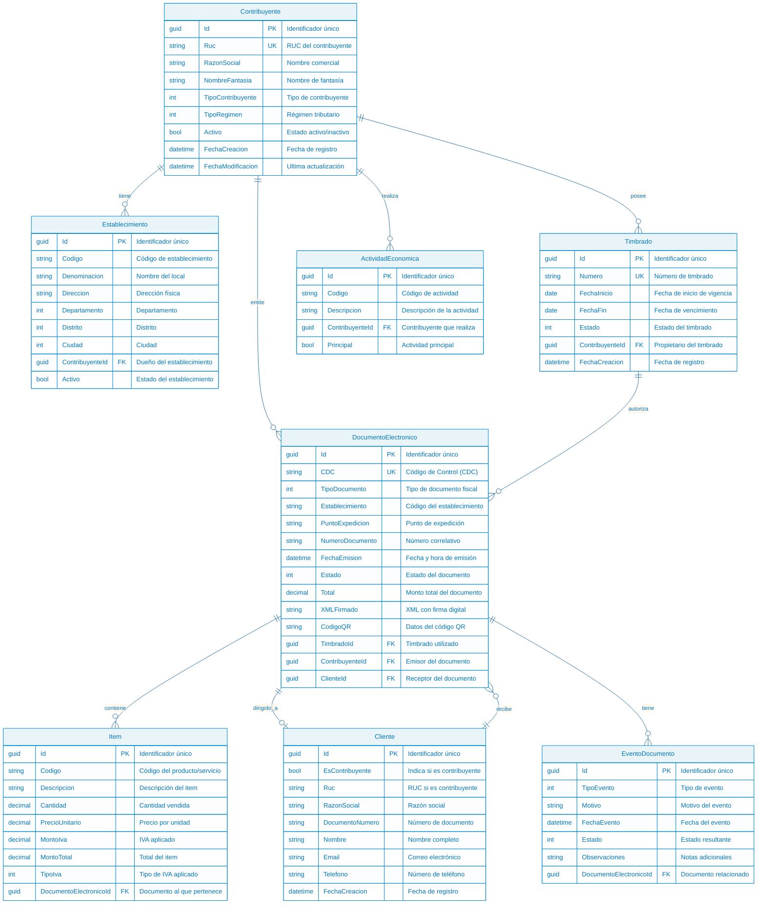

# SIFEN - Modelo de Base de Datos

## Diagrama Entidad-Relación

Este diagrama muestra el modelo de base de datos completo con todas las entidades y sus relaciones.

## Descripción de las Entidades

### 🏛️ Contribuyente
**Descripción**: Entidad principal que representa a una empresa o persona física que emite documentos fiscales.

**Campos clave**:
- **Ruc**: Registro Único de Contribuyentes (único)
- **TipoContribuyente**: Clasifica el tipo de contribuyente según SIFEN
- **TipoRegimen**: Régimen tributario al que pertenece
- **Activo**: Indica si el contribuyente está activo

### 🏢 Establecimiento
**Descripción**: Locales físicos donde se realizan las operaciones comerciales.

**Campos clave**:
- **Codigo**: Código único del establecimiento
- **Direccion**: Ubicación física del establecimiento
- **Departamento, Distrito, Ciudad**: División geográfica
- **ContribuyenteId**: Relación con el contribuyente propietario

### 📄 Timbrado
**Descripción**: Autorización fiscal que permite la emisión de documentos electrónicos.

**Campos clave**:
- **Numero**: Número único del timbrado (otorgado por SET)
- **FechaInicio/FechaFin**: Período de vigencia
- **Estado**: Estado actual del timbrado (vigente, vencido, etc.)

### 📋 DocumentoElectronico
**Descripción**: Entidad central que representa cualquier documento fiscal electrónico.

**Campos clave**:
- **CDC**: Código de Control único generado para cada documento
- **TipoDocumento**: Tipo de documento fiscal (factura, nota de crédito, etc.)
- **Estado**: Estado actual del documento (pendiente, aprobado, rechazado)
- **XMLFirmado**: XML del documento con firma digital
- **CodigoQR**: Datos para generar el código QR

### 📦 Item
**Descripción**: Líneas de detalle de los documentos electrónicos (productos/servicios).

**Campos clave**:
- **Codigo**: Código del producto o servicio
- **Cantidad**: Cantidad vendida
- **PrecioUnitario**: Precio por unidad
- **TipoIva**: Tipo de IVA aplicado (exento, 10%, 5%)

### 👤 Cliente
**Descripción**: Receptores de los documentos electrónicos.

**Campos clave**:
- **EsContribuyente**: Indica si el cliente es también contribuyente
- **Ruc**: RUC si es contribuyente
- **DocumentoNumero**: Cédula de identidad u otro documento

### 📈 EventoDocumento
**Descripción**: Registro de eventos que ocurren durante el ciclo de vida de un documento.

**Campos clave**:
- **TipoEvento**: Tipo de evento (creación, envío, aprobación, error, etc.)
- **FechaEvento**: Momento en que ocurrió el evento
- **Estado**: Estado resultante después del evento

### 💼 ActividadEconomica
**Descripción**: Actividades económicas que puede realizar un contribuyente.

**Campos clave**:
- **Codigo**: Código oficial de la actividad económica
- **Principal**: Indica si es la actividad principal del contribuyente

## Relaciones Principales

### Contribuyente → Establecimiento (1:N)
Un contribuyente puede tener múltiples establecimientos.

### Contribuyente → Timbrado (1:N)
Un contribuyente puede tener múltiples timbrados (histórico y vigentes).

### Contribuyente → DocumentoElectronico (1:N)
Un contribuyente emite múltiples documentos electrónicos.

### Timbrado → DocumentoElectronico (1:N)
Un timbrado autoriza múltiples documentos electrónicos.

### DocumentoElectronico → Item (1:N)
Un documento contiene múltiples líneas de detalle.

### DocumentoElectronico → EventoDocumento (1:N)
Un documento tiene múltiples eventos a lo largo de su ciclo de vida.

### Cliente → DocumentoElectronico (1:N)
Un cliente puede recibir múltiples documentos electrónicos.

## Índices Recomendados

### Índices Únicos
- `Contribuyente.Ruc`
- `Timbrado.Numero`
- `DocumentoElectronico.CDC`

### Índices de Búsqueda
- `DocumentoElectronico.Estado`
- `DocumentoElectronico.FechaEmision`
- `DocumentoElectronico.ContribuyenteId`
- `EventoDocumento.DocumentoElectronicoId`
- `Item.DocumentoElectronicoId`

### Índices Compuestos
- `(ContribuyenteId, Estado)` en DocumentoElectronico
- `(TimbradoId, FechaEmision)` en DocumentoElectronico
- `(DocumentoElectronicoId, TipoEvento)` en EventoDocumento