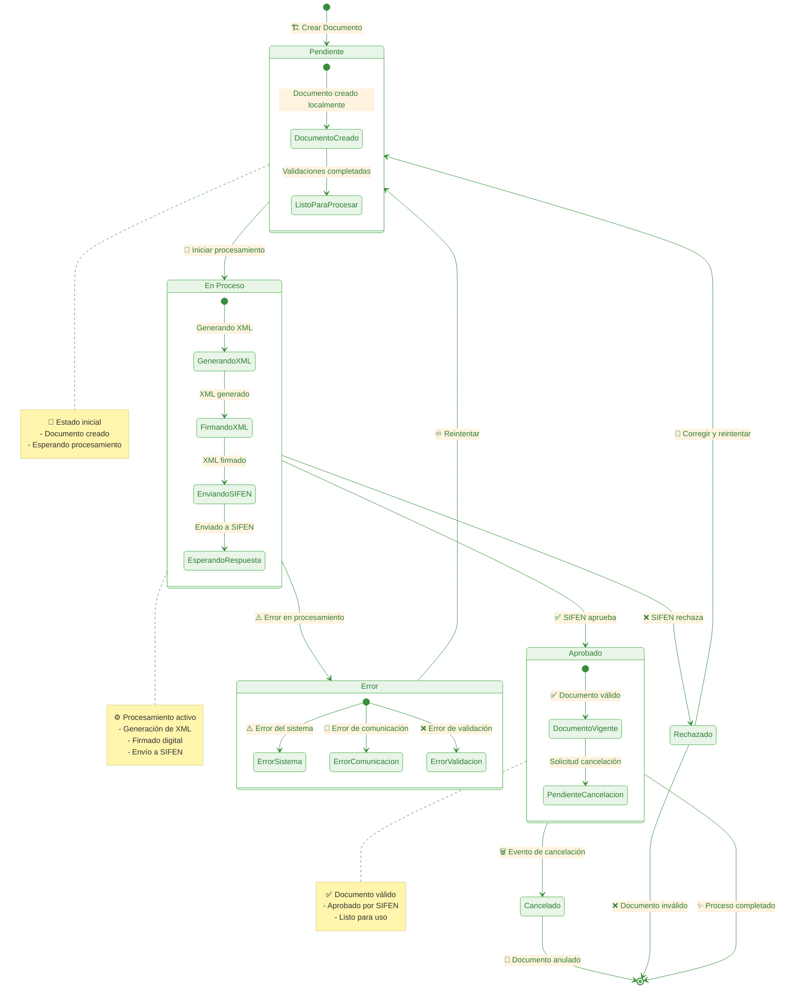

# SIFEN - Estados del Documento Electrónico

## Diagrama de Estados del Documento

Este diagrama muestra todos los posibles estados de un documento electrónico y las transiciones entre ellos.

## Descripción de los Estados

### 📄 Estado Pendiente
**Descripción**: Estado inicial del documento electrónico.

**Sub-estados**:
- **DocumentoCreado**: El documento ha sido creado en el sistema local
- **ListoParaProcesar**: Todas las validaciones han sido completadas

**Transiciones posibles**:
- A **En Proceso**: Cuando se inicia el procesamiento

### ⚙️ Estado En Proceso
**Descripción**: El documento está siendo procesado activamente.

**Sub-estados**:
- **GenerandoXML**: Se está generando el XML del documento
- **FirmandoXML**: Se está aplicando la firma digital
- **EnviandoSIFEN**: Se está enviando el documento a SIFEN
- **EsperandoRespuesta**: Se está esperando la respuesta de SIFEN

**Transiciones posibles**:
- A **Aprobado**: Cuando SIFEN aprueba el documento
- A **Rechazado**: Cuando SIFEN rechaza el documento
- A **Error**: Cuando ocurre un error en el procesamiento

### ✅ Estado Aprobado
**Descripción**: El documento ha sido aprobado por SIFEN y es válido.

**Sub-estados**:
- **DocumentoVigente**: El documento está vigente y puede ser usado
- **PendienteCancelacion**: Se ha solicitado la cancelación del documento

**Transiciones posibles**:
- A **Cancelado**: Cuando se ejecuta la cancelación
- A **[Final]**: Proceso completado exitosamente

### ❌ Estado Rechazado
**Descripción**: El documento fue rechazado por SIFEN.

**Características**:
- El documento no es válido fiscalmente
- Puede contener errores en los datos
- Requiere corrección para volver a procesarse

**Transiciones posibles**:
- A **Pendiente**: Cuando se corrige y reintenta
- A **[Final]**: Si se determina que el documento es definitivamente inválido

### ⚠️ Estado Error
**Descripción**: Ocurrió un error durante el procesamiento.

**Sub-estados**:
- **ErrorSistema**: Error interno del sistema
- **ErrorComunicacion**: Error de comunicación con SIFEN
- **ErrorValidacion**: Error en la validación de datos

**Transiciones posibles**:
- A **Pendiente**: Cuando se resuelve el error y se reintenta

### 🗑️ Estado Cancelado
**Descripción**: El documento ha sido cancelado.

**Características**:
- El documento ya no es válido fiscalmente
- Se ha ejecutado el evento de cancelación
- Estado final del documento

## Eventos que Provocan Transiciones

### 🏗️ Crear Documento
- **Origen**: [*] (estado inicial)
- **Destino**: Pendiente
- **Descripción**: Se crea un nuevo documento electrónico

### 🚀 Iniciar Procesamiento
- **Origen**: Pendiente
- **Destino**: En Proceso
- **Descripción**: Se inicia el procesamiento del documento

### ✅ SIFEN Aprueba
- **Origen**: En Proceso
- **Destino**: Aprobado
- **Descripción**: SIFEN responde positivamente al documento

### ❌ SIFEN Rechaza
- **Origen**: En Proceso
- **Destino**: Rechazado
- **Descripción**: SIFEN rechaza el documento por errores

### ⚠️ Error en Procesamiento
- **Origen**: En Proceso
- **Destino**: Error
- **Descripción**: Ocurre un error técnico durante el procesamiento

### 🔄 Corregir y Reintentar
- **Origen**: Rechazado/Error
- **Destino**: Pendiente
- **Descripción**: Se corrigen los problemas y se reintenta el procesamiento

### 🗑️ Evento de Cancelación
- **Origen**: Aprobado
- **Destino**: Cancelado
- **Descripción**: Se solicita y ejecuta la cancelación del documento