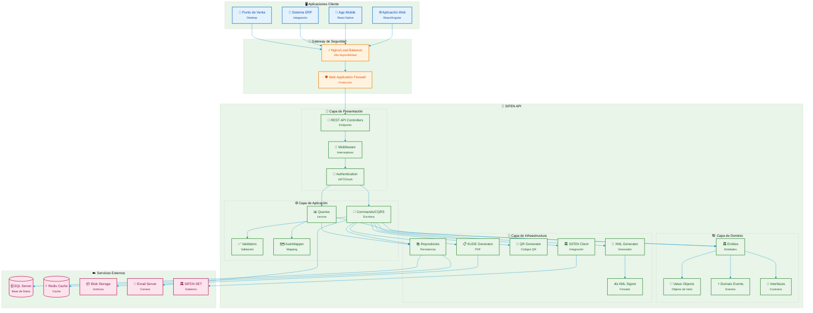

# SIFEN - Arquitectura General del Sistema

## Diagrama de Arquitectura General

Este diagrama muestra la arquitectura completa del sistema SIFEN con todas sus capas y componentes principales.

## Descripción de las Capas

### 🖥️ Aplicaciones Cliente
- **Aplicación Web**: Frontend web desarrollado en React/Angular
- **App Mobile**: Aplicación móvil desarrollada en React Native
- **Sistema ERP**: Integración con sistemas de gestión empresarial
- **Punto de Venta**: Aplicación de escritorio para POS

### 🔐 Gateway de Seguridad
- **Nginx/Load Balancer**: Balanceador de carga y proxy inverso
- **Web Application Firewall**: Protección contra ataques web

### 🚀 SIFEN API
#### 📡 Capa de Presentación
- **REST API Controllers**: Endpoints de la API REST
- **Middleware**: Interceptores para logging, validación, etc.
- **Authentication**: Autenticación JWT/OAuth

#### ⚙️ Capa de Aplicación
- **Commands/CQRS**: Comandos para operaciones de escritura
- **Queries**: Consultas para operaciones de lectura
- **Validators**: Validadores de datos
- **AutoMapper**: Mapeo entre objetos

#### 🏗️ Capa de Dominio
- **Entities**: Entidades del dominio
- **Value Objects**: Objetos de valor
- **Domain Events**: Eventos del dominio
- **Interfaces**: Contratos e interfaces

#### 🔧 Capa de Infraestructura
- **Repositories**: Acceso a datos
- **XML Generator**: Generación de XML SIFEN
- **XML Signer**: Firmado digital de documentos
- **QR Generator**: Generación de códigos QR
- **KUDE Generator**: Generación de PDFs KUDE
- **SIFEN Client**: Cliente para comunicación con SIFEN

### ☁️ Servicios Externos
- **SQL Server**: Base de datos principal
- **Redis Cache**: Cache distribuido
- **Blob Storage**: Almacenamiento de archivos
- **Email Server**: Servidor de correo SMTP
- **SIFEN SET**: Sistema Electrónico de Tributación del gobierno