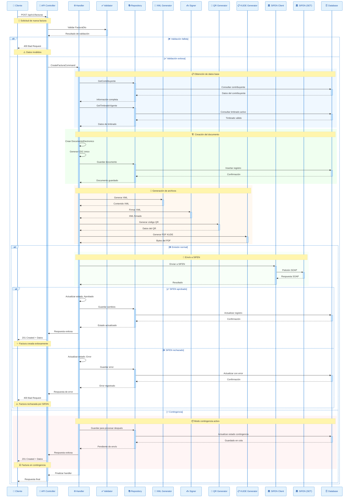

# SIFEN - Flujo de Creación de Factura Electrónica

## Flujo Secuencial Completo

Este diagrama muestra el flujo completo de creación de una factura electrónica desde la solicitud del cliente hasta la respuesta final.

## Descripción del Flujo

### 📥 Fase de Recepción
1. **Solicitud inicial**: El cliente envía una petición POST con los datos de la factura
2. **Validación**: Se validan los datos de entrada usando validators específicos
3. **Manejo de errores**: Si la validación falla, se retorna error 400

### 📋 Fase de Obtención de Datos Base
1. **Datos del contribuyente**: Se obtienen los datos completos del emisor
2. **Timbrado vigente**: Se verifica y obtiene el timbrado activo para la facturación
3. **Validaciones de negocio**: Se verifican las reglas de negocio específicas

### 🏗️ Fase de Creación del Documento
1. **Instanciación**: Se crea la entidad DocumentoElectronico
2. **CDC único**: Se genera el Código de Control único
3. **Persistencia**: Se guarda el documento en la base de datos

### 📝 Fase de Generación de Archivos
1. **XML SIFEN**: Se genera el XML con el formato requerido por SIFEN
2. **Firmado digital**: Se aplica la firma digital al XML
3. **Código QR**: Se genera el código QR con la información del documento
4. **PDF KUDE**: Se genera el PDF con el formato KUDE requerido

### 🚀 Fase de Envío a SIFEN
#### 🌐 Emisión Normal
- Se envía el documento a SIFEN mediante SOAP
- Si es aprobado: se actualiza el estado y se responde exitosamente
- Si es rechazado: se registra el error y se informa al cliente

#### ⚡ Modo Contingencia
- El documento se guarda para procesamiento posterior
- Se responde exitosamente al cliente
- El documento se procesa cuando SIFEN esté disponible

## Códigos de Respuesta

- **201 Created**: Factura creada exitosamente
- **400 Bad Request**: Error en validación o rechazo de SIFEN
- **500 Internal Server Error**: Error interno del sistema