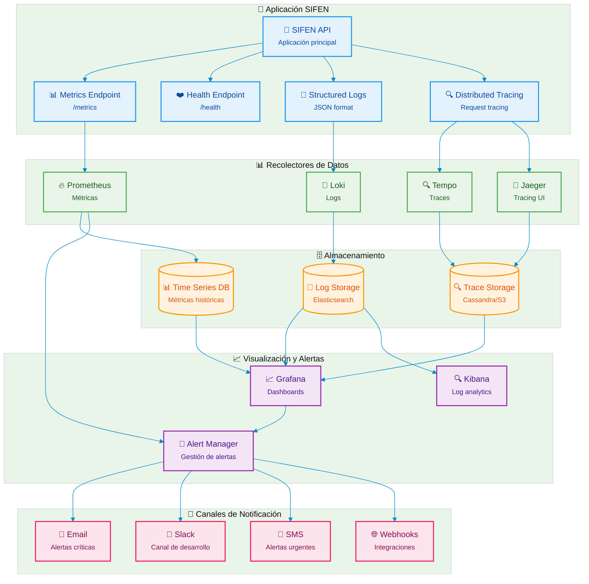

# SIFEN - Monitoreo y Observabilidad

## Diagrama de Arquitectura de Monitoreo

Este diagrama muestra la arquitectura completa de observabilidad del sistema SIFEN con recolección, almacenamiento y visualización de métricas, logs y trazas.



## Los Tres Pilares de la Observabilidad

### 📊 Métricas (Metrics)
**Propósito**: Datos cuantitativos agregados sobre el rendimiento del sistema.

#### Tipos de Métricas
1. **Business Metrics**:
   - Facturas procesadas por minuto
   - Tiempo promedio de procesamiento
   - Tasa de aprobación SIFEN
   - Documentos en contingencia

2. **Application Metrics**:
   - Request rate (req/s)
   - Response time (latencia)
   - Error rate (%)
   - Throughput

3. **Infrastructure Metrics**:
   - CPU utilization
   - Memory usage
   - Disk I/O
   - Network traffic

#### Prometheus Metrics Examples
```csharp
// Custom metrics en la aplicación
private static readonly Counter ProcessedDocuments = Metrics
    .CreateCounter("sifen_documents_processed_total", 
    "Total number of processed documents", 
    new[] { "document_type", "status" });

private static readonly Histogram ProcessingDuration = Metrics
    .CreateHistogram("sifen_processing_duration_seconds",
    "Duration of document processing",
    new[] { "operation" });

private static readonly Gauge ContingencyQueueSize = Metrics
    .CreateGauge("sifen_contingency_queue_size",
    "Number of documents in contingency queue");
```

### 📄 Logs (Logging)
**Propósito**: Registros detallados de eventos específicos del sistema.

#### Structured Logging
```json
{
  "timestamp": "2024-01-15T10:30:15.123Z",
  "level": "INFO",
  "logger": "SIFEN.API.Controllers.FacturaController",
  "message": "Document processed successfully",
  "properties": {
    "documentId": "550e8400-e29b-41d4-a716-446655440000",
    "contributorRuc": "80123456-7",
    "processingTimeMs": 1250,
    "sifenResponse": "APPROVED"
  },
  "traceId": "abc123def456",
  "spanId": "def456ghi789"
}
```

#### Log Levels y Propósito
- **TRACE**: Información muy detallada (debugging)
- **DEBUG**: Información de debugging para desarrollo
- **INFO**: Información general de operaciones
- **WARN**: Situaciones inesperadas pero recuperables
- **ERROR**: Errores que afectan funcionalidad
- **FATAL**: Errores críticos que pueden terminar la aplicación

### 🔍 Trazas (Distributed Tracing)
**Propósito**: Seguimiento de requests a través de múltiples servicios.

#### Trace Structure
```
Trace: Invoice Creation (trace-id: abc123)
├─ Span: API Request (span-id: def456)
│  ├─ Span: Validate Input (span-id: ghi789)
│  ├─ Span: Database Query (span-id: jkl012)
│  ├─ Span: Generate XML (span-id: mno345)
│  ├─ Span: Sign Document (span-id: pqr678)
│  └─ Span: Send to SIFEN (span-id: stu901)
```

## Stack de Herramientas

### 🔥 Prometheus
**Propósito**: Recolección y almacenamiento de métricas.

#### Configuración
```yaml
global:
  scrape_interval: 15s
  evaluation_interval: 15s

scrape_configs:
  - job_name: 'sifen-api'
    static_configs:
      - targets: ['sifen-api:8080']
    metrics_path: '/metrics'
    scrape_interval: 5s
```

#### Alerting Rules
```yaml
groups:
- name: sifen-alerts
  rules:
  - alert: HighErrorRate
    expr: rate(sifen_requests_total{status=~"5.."}[5m]) > 0.1
    for: 2m
    labels:
      severity: critical
    annotations:
      summary: "High error rate detected"
      
  - alert: SIFENDown
    expr: up{job="sifen-api"} == 0
    for: 1m
    labels:
      severity: critical
```

### 📄 Grafana Loki
**Propósito**: Almacenamiento y consulta de logs.

#### Configuración de Ingesta
```yaml
clients:
  - url: http://loki:3100/loki/api/v1/push
    external_labels:
      service: sifen-api
      environment: production
```

#### LogQL Queries Examples
```logql
# Errores en la última hora
{service="sifen-api"} |= "ERROR" | json | __error__ = ""

# Latencia alta en procesamiento de documentos
{service="sifen-api"} | json | processingTimeMs > 5000

# Documentos rechazados por SIFEN
{service="sifen-api"} | json | sifenResponse = "REJECTED"
```

### 🔍 Tempo & Jaeger
**Propósito**: Distributed tracing para seguimiento de requests.

#### Instrumentación en Código
```csharp
using System.Diagnostics;
using OpenTelemetry.Trace;

public class FacturaService
{
    private static readonly ActivitySource ActivitySource = new("SIFEN.API");
    
    public async Task ProcessInvoice(CreateFacturaCommand command)
    {
        using var activity = ActivitySource.StartActivity("ProcessInvoice");
        activity?.SetTag("document.type", "invoice");
        activity?.SetTag("contributor.ruc", command.ContributorRuc);
        
        try
        {
            await ProcessDocument(command);
            activity?.SetStatus(ActivityStatusCode.Ok);
        }
        catch (Exception ex)
        {
            activity?.SetStatus(ActivityStatusCode.Error, ex.Message);
            throw;
        }
    }
}
```

## Dashboards de Grafana

### 📈 Business Dashboard
**Métricas de Negocio**:
- Facturas procesadas por hora/día
- Tiempo promedio de procesamiento
- Tasa de aprobación vs rechazo
- Documentos en cola de contingencia
- Revenue impact metrics

### ⚡ Technical Dashboard
**Métricas Técnicas**:
- Request rate y latencia
- Error rate por endpoint
- CPU/Memory utilization
- Database connection pool
- Redis cache hit rate

### 🏛️ SIFEN Integration Dashboard
**Integración con SIFEN**:
- SIFEN response times
- Success/error rates por tipo de documento
- Batch processing metrics
- Certificate expiration warnings
- Contingency mode activations

### 🚨 SLA Dashboard
**Service Level Agreements**:
- Uptime percentage
- P95/P99 response times
- Error budget consumption
- Apdex score
- MTTR (Mean Time To Recovery)

## Configuración de Alertas

### 🔴 Alertas Críticas (P0)
- **API Down**: Servicio completamente caído
- **Database Unavailable**: BD principal inaccesible
- **SIFEN Integration Failed**: Falla total comunicación SIFEN
- **High Error Rate**: > 10% error rate por 5 minutos
- **Certificate Expiring**: Certificados digitales por vencer

### 🟠 Alertas Importantes (P1)
- **High Latency**: P95 > 5 segundos
- **Contingency Mode**: Activación modo contingencia
- **Queue Backing Up**: > 100 documentos en cola
- **Memory Usage High**: > 85% memory utilization
- **Disk Space Low**: < 15% disk space disponible

### 🟡 Alertas de Warning (P2)
- **Unusual Traffic**: Tráfico atípico detectado
- **Cache Miss Rate High**: Redis cache miss > 20%
- **Background Job Delays**: Jobs atrasados > 10 minutos
- **Performance Degradation**: Degradación gradual

### Escalation Policy
```yaml
escalation_policies:
  - name: "SIFEN Critical"
    escalation_rules:
      - escalation_delay_in_minutes: 0
        targets:
          - type: "user"
            id: "oncall-engineer"
      - escalation_delay_in_minutes: 5
        targets:
          - type: "user" 
            id: "team-lead"
      - escalation_delay_in_minutes: 15
        targets:
          - type: "user"
            id: "engineering-manager"
```

## Canales de Notificación

### 📧 Email
**Uso**: Alertas críticas y reportes diarios
**Template**:
```html
<h2>🚨 SIFEN Alert: {{.GroupLabels.alertname}}</h2>
<p><strong>Severity:</strong> {{.CommonLabels.severity}}</p>
<p><strong>Description:</strong> {{.CommonAnnotations.summary}}</p>
<p><strong>Time:</strong> {{.CommonLabels.timestamp}}</p>
<a href="{{.CommonAnnotations.runbook_url}}">Runbook</a>
```

### 💬 Slack
**Uso**: Notificaciones en tiempo real al equipo
**Integration**:
```json
{
  "channel": "#sifen-alerts",
  "username": "Grafana",
  "title": "{{.GroupLabels.alertname}}",
  "text": "{{.CommonAnnotations.summary}}",
  "color": "{{if eq .Status \"firing\"}}danger{{else}}good{{end}}"
}
```

### 📱 SMS/Webhook
**Uso**: Alertas críticas fuera de horario
**Escalation**: Solo para P0 y P1 después de horarios laborales

## Métricas SLI/SLO

### 🎯 Service Level Indicators (SLI)
1. **Availability**: Uptime del servicio
2. **Latency**: P95 response time < 2 segundos
3. **Throughput**: Documentos procesados por minuto
4. **Error Rate**: < 1% de requests fallando

### 📊 Service Level Objectives (SLO)
```yaml
slos:
  - name: "API Availability"
    target: 99.9%
    window: "30d"
    
  - name: "Response Latency"
    target: 95% # of requests < 2s
    window: "7d"
    
  - name: "Document Processing"
    target: 99.5% # success rate
    window: "24h"
```

### 💰 Error Budget
- **Monthly Budget**: 0.1% (43.8 minutos de downtime)
- **Budget Burn Rate**: Monitoreo continuo
- **Policy**: Freeze releases si budget < 10%

## Runbooks y Procedimientos

### 📖 Common Runbooks
1. **API Down**: Pasos para diagnosticar y resolver
2. **High Latency**: Checklist de performance tuning  
3. **SIFEN Integration Issues**: Troubleshooting comunicación
4. **Database Problems**: Recovery procedures
5. **Certificate Renewal**: Proceso de renovación

### 🔍 Incident Response
1. **Detection**: Alerta automática o reporte manual
2. **Assessment**: Determinar severity y impact
3. **Response**: Ejecutar runbook correspondiente
4. **Communication**: Notificar stakeholders
5. **Resolution**: Resolver y documentar
6. **Post-mortem**: Análisis y mejoras

## Retención y Archivado

### 📊 Métricas
- **High resolution** (15s): 15 días
- **Medium resolution** (5m): 90 días  
- **Low resolution** (1h): 1 año

### 📄 Logs
- **Application logs**: 30 días en hot storage
- **Audit logs**: 7 años (compliance fiscal)
- **Debug logs**: 7 días
- **Archive**: S3 Glacier para long-term storage

### 🔍 Traces
- **Detailed traces**: 7 días
- **Sampled traces**: 30 días
- **Error traces**: 90 días