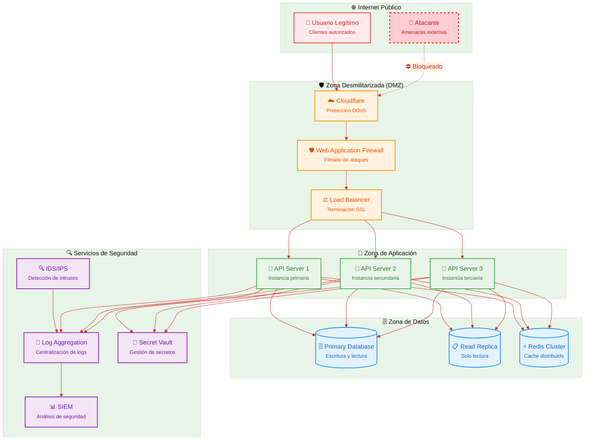

# SIFEN - Arquitectura de Seguridad

## Diagrama de Arquitectura de Seguridad

Este diagrama muestra las diferentes capas de seguridad del sistema SIFEN, desde el perímetro exterior hasta los datos internos.

## Descripción de las Capas de Seguridad

### 🌐 Perímetro de Internet
**Propósito**: Primera línea de defensa contra amenazas externas.

#### Amenazas Mitigadas:
- Ataques DDoS masivos
- Bots maliciosos
- Tráfico anómalo
- Geolocalización sospechosa

#### Controles Implementados:
- Rate limiting por IP
- Blacklisting de IPs maliciosas
- Filtrado geográfico
- Detección de patrones de ataque

### 🛡️ Zona Desmilitarizada (DMZ)

#### ☁️ Cloudflare
**Funciones de Seguridad**:
- **Protección DDoS**: Mitigación automática de ataques volumétricos
- **Rate Limiting**: Límites por IP, país y patrón de uso
- **Bot Management**: Detección y bloqueo de bots maliciosos
- **SSL/TLS**: Terminación y re-encriptación de conexiones

#### 🛡️ Web Application Firewall (WAF)
**Reglas de Protección**:
- **OWASP Top 10**: Protección contra vulnerabilidades web comunes
- **SQL Injection**: Detección y bloqueo de inyección SQL
- **XSS**: Prevención de cross-site scripting
- **Custom Rules**: Reglas específicas para SIFEN

#### ⚖️ Load Balancer
**Funciones de Seguridad**:
- **SSL Termination**: Manejo centralizado de certificados
- **Health Checks**: Verificación de salud de servidores
- **Session Affinity**: Gestión segura de sesiones
- **Failover**: Redundancia automática

### 🚀 Zona de Aplicación

#### Controles de Seguridad por Servidor
1. **Autenticación Multi-Factor**:
   - JWT tokens con expiración
   - Refresh token rotation
   - OAuth 2.0 / OpenID Connect
   - Certificate-based authentication

2. **Autorización Granular**:
   - Role-Based Access Control (RBAC)
   - Resource-level permissions
   - API endpoint protection
   - Dynamic authorization

3. **Validación de Entrada**:
   - Input sanitization
   - Schema validation
   - Business rule validation
   - Anti-tampering controls

4. **Protección de Datos**:
   - Encryption at rest
   - Encryption in transit
   - PII data masking
   - Secure key management

### 🗄️ Zona de Datos

#### 🗄️ Primary Database
**Controles de Seguridad**:
- **Encryption at Rest**: AES-256 encryption
- **Connection Security**: TLS 1.3 para todas las conexiones
- **Access Control**: Database-level permissions
- **Audit Logging**: Log completo de accesos y modificaciones

#### 📋 Read Replica
**Funciones**:
- Separation of concerns (solo lectura)
- Reduced attack surface
- Data segregation
- Performance isolation

#### ⚡ Redis Cluster
**Seguridad**:
- Authentication required
- Network isolation
- Data encryption
- Memory protection

### 🔍 Servicios de Seguridad

#### 🔍 IDS/IPS (Intrusion Detection/Prevention System)
**Capacidades**:
- **Network Monitoring**: Análisis de tráfico en tiempo real
- **Anomaly Detection**: Detección de comportamientos anómalos
- **Threat Intelligence**: Integración con feeds de amenazas
- **Automated Response**: Bloqueo automático de amenazas

#### 📄 Log Aggregation
**Fuentes de Logs**:
- Application logs (API servers)
- Security logs (WAF, IDS/IPS)
- System logs (OS, infrastructure)
- Audit logs (database, authentication)

#### 📊 SIEM (Security Information and Event Management)
**Funcionalidades**:
- **Correlation Rules**: Detección de patrones de ataque
- **Alerting**: Notificaciones en tiempo real
- **Dashboards**: Visualización de métricas de seguridad
- **Incident Response**: Workflows de respuesta automatizados

#### 🔐 Secret Vault
**Gestión de Secretos**:
- Certificados digitales
- API keys y tokens
- Database credentials
- Encryption keys

## Medidas de Seguridad Específicas de SIFEN

### 🏛️ Integración con SIFEN SET
1. **Mutual TLS**: Autenticación mutua con certificados
2. **Message Signing**: Firma digital de todos los mensajes
3. **Timestamp Validation**: Validación de sellos de tiempo
4. **Non-repudiation**: Garantía de no repudio

### 📄 Protección de Documentos Fiscales
1. **Digital Signatures**: Firma digital obligatoria
2. **Hash Verification**: Verificación de integridad
3. **Audit Trail**: Trazabilidad completa
4. **Document Versioning**: Control de versiones

### 🔑 Gestión de Certificados Digitales
1. **Certificate Storage**: Almacenamiento seguro
2. **Certificate Rotation**: Renovación automática
3. **Revocation Checking**: Verificación de revocación
4. **HSM Integration**: Módulos de seguridad hardware

## Políticas de Seguridad

### 🔒 Política de Acceso
- **Principio de menor privilegio**
- **Segregación de funciones**
- **Revisión periódica de permisos**
- **Acceso basado en roles**

### 📝 Política de Auditoría
- **Logging obligatorio** para todas las operaciones críticas
- **Retención de logs** por mínimo 7 años
- **Integridad de logs** mediante hash chains
- **Acceso controlado** a logs de auditoría

### 🚨 Respuesta a Incidentes
1. **Detección**: Monitoreo 24/7 con SIEM
2. **Contención**: Aislamiento automático de amenazas
3. **Erradicación**: Eliminación de la causa raíz
4. **Recuperación**: Restauración segura de servicios
5. **Lessons Learned**: Mejora continua del proceso

### 🔄 Continuidad del Negocio
- **Backup automatizado** con cifrado
- **Disaster Recovery Plan** testado mensualmente
- **RTO**: Recovery Time Objective < 4 horas
- **RPO**: Recovery Point Objective < 1 hora

## Compliance y Normativas

### 📋 Cumplimiento Fiscal
- **Resolución SET**: Cumplimiento de normativas paraguayas
- **Retención de datos**: Según legislación fiscal
- **Auditorías**: Preparación para auditorías regulatorias

### 🔐 Seguridad de la Información
- **ISO 27001**: Framework de seguridad
- **OWASP**: Mejores prácticas de seguridad web
- **PCI DSS**: Si se manejan datos de tarjetas (futuro)

### 📊 Monitoreo de Compliance
- **Automated Compliance Checks**
- **Regular Security Assessments**
- **Penetration Testing** trimestral
- **Vulnerability Scanning** semanal